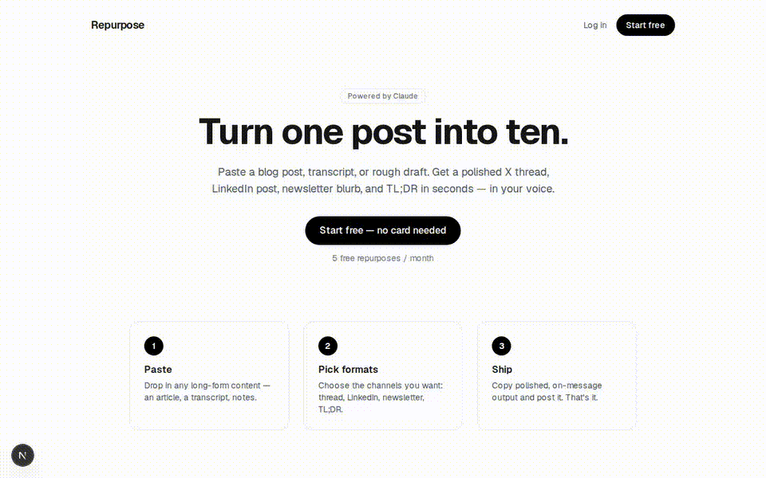

# Repurpose

Repurpose turns one piece of long-form content into many. Paste a blog post, transcript, or
draft and get a polished X/Twitter thread, LinkedIn post, newsletter blurb, and TL;DR in
seconds. It is a full-stack Next.js application with accounts, usage metering, and
subscription billing.

## Features

- Email/password authentication with signed, HTTP-only session cookies, plus optional Google
  sign-in (OAuth authorization-code flow, env-gated)
- Password reset and email verification via single-use emailed links (Resend), with graceful
  degradation when no mail provider is configured
- Content repurposing into six formats (X thread, LinkedIn, newsletter, TL;DR, Instagram,
  YouTube), each with a purpose-tuned prompt (powered by Claude)
- Progressive streaming output — results render as Claude generates them
- Per-user voice & style notes injected into every generation prompt
- Generation history with stored source and outputs (view, copy, delete)
- Per-account monthly usage metering with automatic rollover
- Team seats: members pool the owner's plan and monthly limit via invite codes
- Free and Pro plans (monthly or annual), with plan-based limits on volume and input length
- Subscription billing via Stripe Checkout, the customer portal, and webhooks
- Account settings: change email/password, voice notes, team management, account deletion
- Admin funnel dashboard (signups → activated → paid) gated by an email allowlist
- Per-IP rate limiting on the auth endpoints (production)
- Marketing landing page with pricing and a dynamic Open Graph image

## Demo

A 90-second walkthrough of every flow — landing, signup, email verification, voice notes,
streaming generation, history, team seats, annual upgrade, Google sign-in, and the admin
funnel — recorded against the bundled mock Anthropic/Google servers (no real keys needed):



Re-record it any time with `node scripts/demo.mjs` (see the header comment for the required
mock servers and env). An MP4 version lives at `docs/media/demo/full-demo.mp4`.

## Tech stack

| Area        | Choice                                            |
| ----------- | ------------------------------------------------- |
| Framework   | Next.js 16 (App Router), React 19, TypeScript     |
| Styling     | Tailwind CSS 4                                     |
| Database    | SQLite via libSQL (local file or Turso in prod)   |
| ORM         | Drizzle ORM + Drizzle Kit migrations              |
| Validation  | Zod (request bodies and environment)              |
| Auth        | bcryptjs + jose (JWT) session cookies             |
| AI          | Anthropic SDK (Claude)                            |
| Payments    | Stripe                                            |
| Tooling     | pnpm, Biome, Husky, Playwright, GitHub Actions    |

## Getting started

Prerequisites: Node.js 20+ and pnpm (the repo pins a version via `packageManager`; Corepack
will use it automatically).

```bash
pnpm install
cp .env.example .env          # then set AUTH_SECRET and ANTHROPIC_API_KEY (see below)
pnpm db:migrate               # create the SQLite database from migrations
pnpm dev                      # http://localhost:3000
```

The minimum needed to run the app locally:

- `AUTH_SECRET` — a long random string. Generate one with `openssl rand -base64 32`.
- `ANTHROPIC_API_KEY` — from the Anthropic Console; required for content generation.

Stripe variables are only needed to enable billing.

## Environment variables

| Variable                 | Required        | Description                                           |
| ------------------------ | --------------- | ----------------------------------------------------- |
| `DATABASE_URL`           | yes             | libSQL URL. `file:./dev.db` locally; Turso in prod.   |
| `DATABASE_AUTH_TOKEN`    | prod (Turso)    | Auth token for a remote libSQL/Turso database.        |
| `AUTH_SECRET`            | yes             | Secret used to sign session JWTs.                     |
| `ANTHROPIC_API_KEY`      | for generation  | Claude API key.                                       |
| `STRIPE_SECRET_KEY`      | for billing     | Stripe secret key.                                    |
| `STRIPE_WEBHOOK_SECRET`  | for billing     | Signing secret for the Stripe webhook endpoint.       |
| `STRIPE_PRICE_ID`        | for billing     | Recurring Price ID for the Pro plan (monthly).        |
| `STRIPE_PRICE_ID_ANNUAL` | optional        | Recurring Price ID for annual billing.                |
| `RESEND_API_KEY`         | for email       | Resend key; enables password reset + verification.    |
| `EMAIL_FROM`             | optional        | From address for transactional email.                 |
| `GOOGLE_CLIENT_ID`       | for Google SSO  | OAuth client ID; enables "Continue with Google".      |
| `GOOGLE_CLIENT_SECRET`   | for Google SSO  | OAuth client secret.                                  |
| `ADMIN_EMAILS`           | optional        | Comma-separated emails allowed to view `/admin`.      |
| `NEXT_PUBLIC_APP_URL`    | yes             | Public base URL, used for redirects and email links.  |

Environment variables are validated at startup with Zod (`src/lib/env.ts`). Missing optional
secrets degrade the related feature gracefully rather than crashing the app.

## Scripts

| Script             | Description                                       |
| ------------------ | ------------------------------------------------- |
| `pnpm dev`         | Start the dev server.                             |
| `pnpm build`       | Production build.                                 |
| `pnpm start`       | Run the production build.                         |
| `pnpm typecheck`   | TypeScript, no emit.                              |
| `pnpm check`       | Biome lint + format, with autofix.                |
| `pnpm check:ci`    | Biome in CI mode (no writes).                     |
| `pnpm db:generate` | Generate a migration from schema changes.         |
| `pnpm db:migrate`  | Apply pending migrations.                         |
| `pnpm db:push`     | Push the schema directly (prototyping).           |
| `pnpm db:studio`   | Open Drizzle Studio.                              |
| `pnpm test:e2e`    | Run the Playwright suite (desktop + mobile).      |
| `pnpm preflight`   | Check environment configuration.                  |

## Database and migrations

The schema lives in `src/db/schema.ts`. After changing it:

```bash
pnpm db:generate   # writes a new SQL migration into ./drizzle
pnpm db:migrate    # applies it
```

Migrations are committed to source control so every environment converges on the same schema.

## Testing

End-to-end tests use Playwright and run against a real browser across two projects, a desktop
Chrome viewport and a Pixel 5 mobile viewport. They cover the happy paths, edge cases
(validation, auth errors, usage limits), and the integrations. Playwright boots two mock
servers alongside the app — `scripts/mock-anthropic.mjs` (Messages API, streaming + JSON) and
`scripts/mock-google.mjs` (OAuth) — so real generations and the full Google sign-in flow run
deterministically without live keys. Stripe stays mocked at the network boundary.

```bash
pnpm test:e2e
```

## Code quality

- **Biome** handles linting and formatting.
- **Husky** runs a pre-commit hook: Biome check, TypeScript typecheck, and a dependency audit.
- **GitHub Actions** runs the same checks plus the full e2e suite on every pull request to
  `main`, and these must pass before a change is merged.
- **release-please** opens and maintains release pull requests from Conventional Commits.

## Deployment

Repurpose is a server-rendered application: it needs a host that runs a Node.js server (for
example Vercel, Fly.io, Render, or a VPS). For the database, point `DATABASE_URL` at a hosted
libSQL/Turso database and set `DATABASE_AUTH_TOKEN`. Provide the remaining environment
variables, run `pnpm db:migrate`, and deploy.

To enable billing, create a recurring Price in Stripe, configure a webhook to
`/api/stripe/webhook` for the `checkout.session.completed` and `customer.subscription.*`
events, and set the Stripe environment variables.

## Project structure

```
src/
  app/
    page.tsx                     Landing page and pricing
    (auth)/login, signup         Auth pages (shared auth-form.tsx)
    dashboard/                   Authenticated app (server page + client UI)
    api/
      auth/{signup,login,logout} Session auth
      repurpose/                 Core generation endpoint + usage metering
      stripe/{checkout,portal,webhook}
    opengraph-image.tsx          Dynamic OG image
  db/
    schema.ts                    Drizzle schema
    index.ts                     Drizzle client (libSQL)
  lib/
    auth.ts                      Sessions and password hashing
    env.ts                       Zod-validated environment
    validation.ts                Zod request schemas
    plans.ts                     Plan limits
    repurpose.ts                 Claude prompts and generation
    stripe.ts                    Stripe client
drizzle/                         Generated SQL migrations
e2e/                             Playwright tests
```

## License

Private and unpublished.
